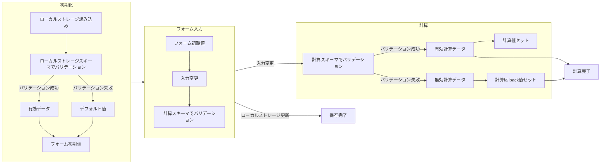

```mermaid
flowchart LR
    %% 初期化 %%
    subgraph Initialization [初期化]
        direction TB
        A1[ローカルストレージ読み込み] --> A2[ローカルストレージスキーマでバリデーション]
        A2 -->|バリデーション成功| A3[有効データ]
        A3 --> A4[フォーム初期値]
        A2 -->|バリデーション失敗| A5[デフォルト値]
        A5 --> A4
    end

    %% フォーム入力 %%
    subgraph FormInput [フォーム入力]
        direction TB
        F1[フォーム初期値] --> F2[入力変更]
        F2 --> F3[計算スキーマでバリデーション]
    end

    %% 計算 %%
    subgraph Calculate [計算]
        direction BT
        
        C1[計算スキーマでバリデーション] -->|バリデーション成功| C2[有効計算データ]
        C2 --> C3[計算値セット]
        C1 -->|バリデーション失敗| C4[無効計算データ]
        C4 --> C5[計算fallback値セット]
    end

    %% メインフロー %%
    Initialization --> FormInput
    FormInput -->|入力変更| C1
    FormInput -->|ローカルストレージ更新| S1[保存完了]
    C2 --> S2[計算完了]
    C5 --> S2

```
